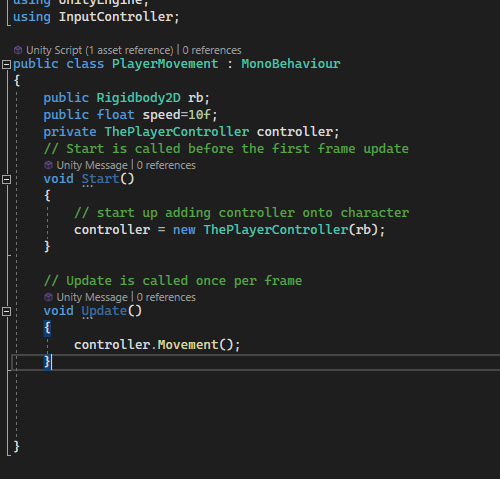
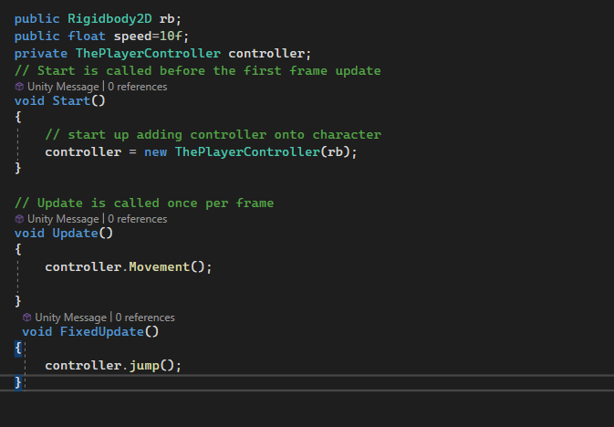

# 介紹目錄結構，此目錄結構並未完整整理，僅供教學使用。

## 目錄結構皆是素材包和unity自動生成。
```
├─Assets
│  ├─Scenes
│  └─SunnyLand Artwork
│      ├─Environment
│      │  ├─props
│      │  └─Tileset
│      ├─Music tracks
│      ├─Scenes
│      └─Sprites
│          ├─Enemies
│          │  ├─bat
│          │  │  ├─bat-fly
│          │  │  └─bat-hang
│          │  ├─bear
│          │  ├─Bettle
│          │  ├─bunny
│          │  ├─Dino
│          │  ├─Dino-Idle
│          │  ├─Dog
│          │  ├─Dog-idle
│          │  ├─eagle
│          │  ├─Eagle Dive Attack
│          │  ├─Eagle Hurt
│          │  ├─frog
│          │  │  ├─idle
│          │  │  └─jump
│          │  ├─opossum
│          │  ├─pig
│          │  ├─Slimer
│          │  ├─Slimer-Idle
│          │  ├─Vulture
│          │  └─Vulture-Idle
│          ├─Fx
│          │  ├─enemy-death
│          │  └─item-feedback
│          ├─Items
│          │  ├─cherry
│          │  └─gem
│          └─player
│              ├─climb
│              ├─crouch
│              ├─hurt
│              ├─idle
│              ├─jump
│              └─run
├─ other Directory....
```
# 目錄結構一:Assets
``
~/.Assets/Scenes -> 世界場景
``

``
~/.Assets/* -> 插件、素材包集合
``

# sunnyland(一般素材包)

## sunnyland/environment 建立環境

## 操作介紹: 右上角都可以把顯示先關掉，有助於我們調整素材。
``
back.png->背景 請先調整背景像素 pixels Per unit -16
``

``
tileset.png -> window->2D->Tile Palette 可以將tilset放進Tile Palette中
``

先創立一個``tileMap`` 2D->tileMap->Rectangular，將視圖切割成網格狀

至此可以開始使用 Tile Palette 的筆刷工具繪製2D地圖。

## sunnyland/sprites/player 開始創立玩家
1. ``2D->sprite`` 建立物件，並拖拽player idle到 2D物件上
2. 增加 rigidbody 2D 、box collider 2D 並調整collider 碰撞範圍
3. tileMap 設定 tile collider 2D

# 移動
Input 控制項 -> `` Edit->Project Setting->Input ``
將玩家的鋼體物件的位置 調整到新的vector 上即可完成移動。
```
void Movement()
    {
        float horizontalmove;
        horizontalmove=Input.GetAxis("Horizontal");

        if(horizontalmove !=0 )
        {
           Debug.Log(horizontalmove);
            rb.velocity=new Vector2(horizontalmove*speed,rb.velocity.y); // rb new position is on 
        }
       // Debug.Log(rb.velocity);
    }
```
# 開發:移動(自行優化)
這段代碼感覺可以優化成設置一份InputController
可以導入InputController
並且將玩家的鋼體傳入，並且以淺拷貝的方式重新賦予玩家鋼體位置。

創立 InputController namespace 
代碼如下
```

using UnityEngine;
/*
以上為了拿取 unity引擎的類型推斷(Rigidbody2D)
*/
namespace InputController{
    public class ThePlayerController
    {
        Rigidbody2D rb;
        float speedX;
        float speedY;
        float jumpForce = 0.7f;
        public ThePlayerController(Rigidbody2D playerRb, float playerSpeedX= 10, float playerSpeedY = 10)
        {
            rb = playerRb;
            speedX = playerSpeedX;
            speedY = playerSpeedY;

        }
        public void Movement()
        {
            float horizontalmove = Input.GetAxis("Horizontal");
            if (horizontalmove != 0)
            {
                // if only vertical changement in jump then should use rb.velocity.y instead of movement
                rb.velocity = new Vector2(horizontalmove * speedX, rb.velocity.y);
            }
        }
        public void talk()
        {
        }
        public bool Grounded
        {
            get => Physics2D.Raycast(rb.position, -Vector2.up, 0.1f);

        }
        public void jump()
        {
            if (Input.GetButton("Jump") && Grounded)
            {
                rb.AddForce(Vector2.up * jumpForce, ForceMode2D.Impulse);
            }
        }
  
    }//end class
} // end namespace
```
#問題整理:
目前使用getter 來找尋控制器是否是在地上，如果在地上則使用飛翔的動畫(動畫位置入)，要確認角色是否真的在地上，還未完成正確的回傳值。
玩家代碼重構:

目前想起來，跳躍應該是要被放在固定時間的FixedUpdate，會較為準確一點，而不應該以每一幀呼叫

現在只要初始化controller，就可以自己載入腳色的動作。